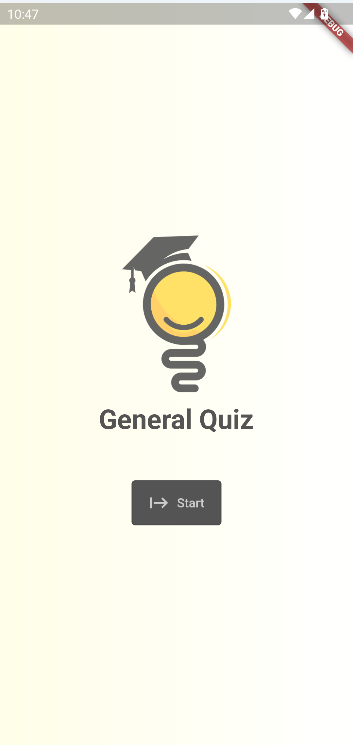
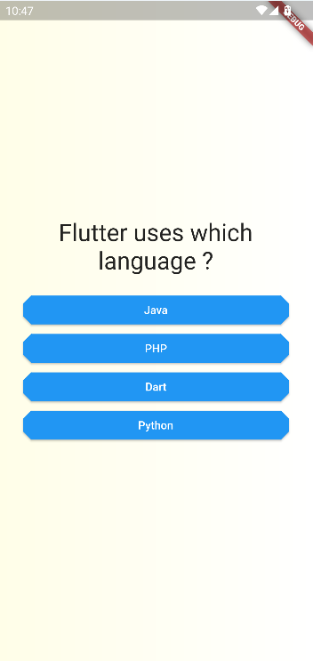

# Quiz App

Welcome to Quiz App, a fun and interactive quiz experience on your mobile device! Test your knowledge in various categories and challenge yourself with timed quizzes.

## Screenshots

*Main Screen*

*Questions Screen*

*Result Screen*

## Features

- User-friendly interface for an intuitive experience.
- Diverse quiz questions covering multiple categories.
- Score tracking to monitor your progress.
- Result on your performance.

## Installation

To install Quiz App on your device, follow these steps:

1. Clone the repository: `git clone https://github.com/devxasd/quiz-app.git`
2. Open the project in your preferred code editor.
3. Run `flutter pub get` to fetch the dependencies.
4. Connect your device or emulator.
5. Run `flutter run` to launch the app.

## Feedback

We value your feedback! If you have any suggestions, bug reports, or feature requests, please open an issue on the [GitHub repository](https://github.com/devxasd/quiz-app/issues).

## Contributing

Contributions are welcome! If you'd like to contribute to Quiz App, please follow the guidelines in the [CONTRIBUTING.md](CONTRIBUTING.md) file.

## License

This project is licensed under the [MIT License](LICENSE).

